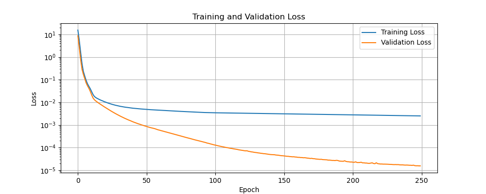

# Kolmogorov-Arnold Networks (KAN)

Kolmogorov-Arnold Networks (KANs) are a novel type of neural network that replace traditional fixed weights with learnable functions (splines) on the edges. 
This approach offers improved accuracy and interpretability over traditional models like MLPs, particularly for small-scale tasks.

## Key Features

- **Edge-Based Activations**: Places learnable activation functions on edges rather than fixed activations on nodes.
- **B-Spline Parametrization**: Utilizes spline functions for universal approximation.
- **Interpretable Structure**: AInterpretability to facilitate scientific discovery.
- **Grid Extension**: Allows for grid refinement during training to improve model accuracy.


## Usage

### Time Series Prediction

```python
import torch
from KAN import KAN
from utils import prepare_data, visualize_results

# Model configuration
input_dim = 1
hidden_dim = 32
output_dim = 1
width = [input_dim, hidden_dim, output_dim]
grid = 8    # Number of control points in B-spline
k = 3       # Degree of B-spline

# Create and train model
model = KAN.create(width, grid, k, device='cuda')
model, losses = KAN.train(model, train_loader, val_loader, epochs=100, learning_rate=0.003)

# Visualize results
visualize_results(model, sample_data, save_dir='images')
```

### Function Approximation



These results were obtained using a [1, 32, 1] KAN architecture with cubic B-splines (k=3) on 8 grid points, trained for 250 epochs with learning rate 0.003 on a dataset of 10,000 samples.
We can see that KANs are able to model our dataset and find that KANs provide excellent training and validation losses.

## Citation

If you use this code in your research, please cite:

```bibtex
@software{pjm2025KAN,
  author = {Paul J Mello},
  title = {Kolmogorov-Arnold Networks},
  url = {https://github.com/pauljmello/Kolmogorov-Arnold-Networks},
  year = {2025},
}
```

## References

[1] Liu, Z., Wang, Y., Vaidya, S., Ruehle, F., Halverson, J., Soljačić, M., Hou, T. Y., & Tegmark, M. (2025). KAN: Kolmogorov-Arnold Networks. International Conference on Learning Representations (ICLR). arXiv:2404.19756.
